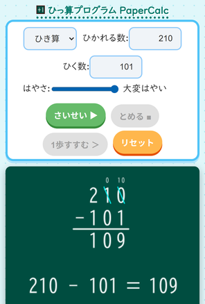

# Written Arithmetic Calculator "PaperCalc"

## What is this?

PaperCalc is a JavaScript program that automatically demonstrates step-by-step written arithmetic — addition, subtraction, multiplication, and division.

It is a web-based learning tool aimed at elementary school students (grade 3 and above).

- Demo: https://katahiromz.github.io/paper-calc/

<p align="center">
  
</p>

## Development Setup

### Requirements

- [Node.js](https://nodejs.org/) (includes npm)

### Install dependencies

```sh
npm install
```

### Build

Compile JavaScript files to `dist/` and copy static assets:

```sh
npm run build
```

### Watch mode

Recompile automatically on file changes (JS/TS only; re-run build for asset changes):

```sh
npm run watch
```

### Type-check without emitting output

```sh
npm run typecheck
```

### Serve locally

After building, serve the `dist/` directory with any static file server. For example:

```sh
# Using Python (built-in)
python3 -m http.server 8080 --directory dist

# Or using Node.js npx
npx serve dist
```

Then open `http://localhost:8080` in your browser.

## License

- MIT

## Contact

- Katayama Hirofumi MZ <katayama.hirofumi.mz@gmail.com>
